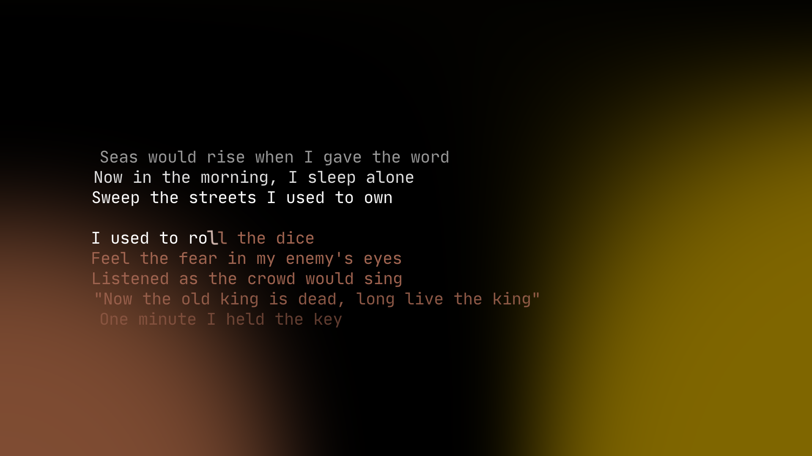

## Lyricify
A simple program to display the currently playing lyrics!

## Requirements
- Linux (Windows currently isn't supported)
- uv

## How to run
1. Clone the GitHub repo
2. Open your terminal in the downloaded folder
3. Run **uv run main.py**

## How to configure
- you can't (at least for now)